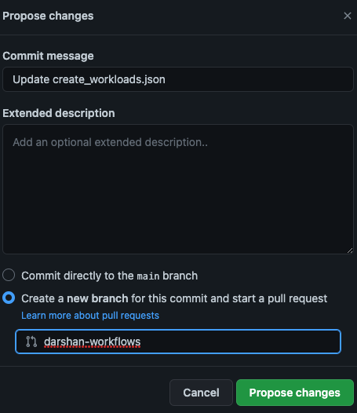
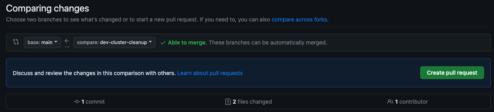
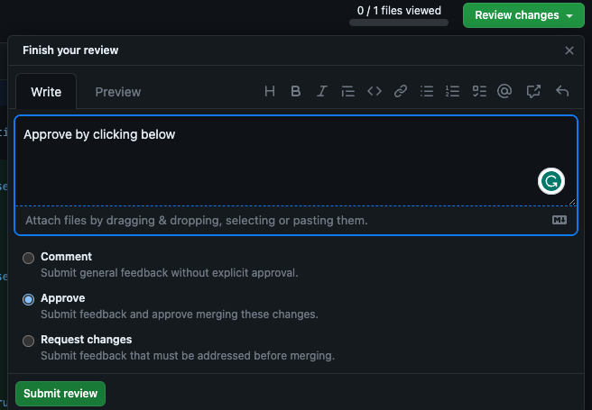
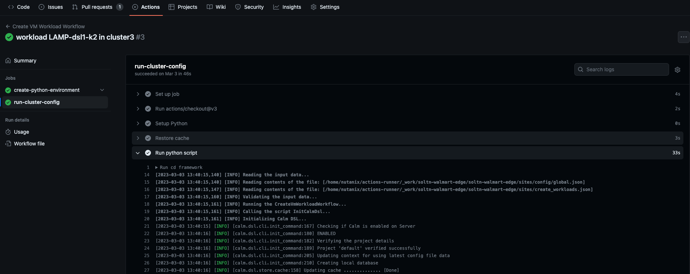
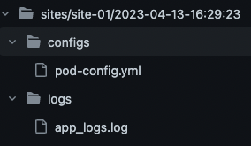
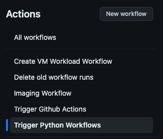
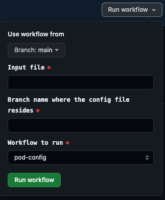

## GitOps

### Prerequisite

We need a Ubuntu VM, which is configured as a self-hosted runner. This VM, should have network connectivity to the
Prism-Central and the clusters in consideration.
Click [here](https://docs.github.com/en/actions/hosting-your-own-runners/managing-self-hosted-runners) to read how to
configure self-hosted runner to your repository.

### Required parameters

Read about the required parameters to run the framework [here](../README.md#framework-usage).

### Github pipelines

We can use **Github workflows/ pipelines** to manage GitOps i.e using this repository to manage Infrastructure as a
Code (IaaC), that gets triggered from Github.
> A **Github workflow** is a configurable automated process that will run one or more jobs. Workflows are defined by a
> YAML file checked in to your repository and will run when triggered by an event in your repository, or they can be
> triggered manually, or at a defined schedule.

### How to auto-trigger pre-configured workflows

There are several pre-configured **Github workflows/ pipelines**. All the below mentioned workflows are triggered by the
approval of a PR containing the configuration file changes.
Here is the step-by-step guide.

- Create a new branch/ use an existing branch other than `main`.
- Modify any of the following pre-configured configured files [config/new-site.json](new-site.json)
  , [config/pod-config.yml](pod-config.yml), [config/create-vm-workloads.json](create-vm-workloads.json)
  , [config/edge-ai.json](edge-ai.json) with the corresponding configuration changes for your environment.
- Create a **Pull-Request (PR)** from this branch to **main**.
- Get an approval for the changes.

That's it. The corresponding workflow/s kick in. Below is the details of workflows that are triggered by the
configuration files changes.

- **Imaging workflow** - This Github workflow gets triggered when the file [config/new-site.json](new-site.json) is part
  of the PR. This Github workflow will setup the necessary Python environment and calls the framework as below
    ```sh
    > cd framework && python main.py --workflow imaging -f config/new-site.json
    ```
- **Pod config workflow** - This Github workflow gets triggered when the file [config/pod-config.yml](pod-config.yml) is
  part of the PR. This Github workflow will setup the necessary Python environment and calls the framework as below
    ```sh
    > cd framework && python main.py --workflow pod-config -f config/pod-config.yml
    ```
- **VM workloads workflow** - This Github workflow gets triggered when the
  file [config/create_workloads.json](create-vm-workloads.json) is part of the PR. This Github workflow will setup the
  necessary Python environment and calls the framework as below
    ```sh
    > cd framework && python main.py --workflow calm-vm-workloads -f config/create-vm-workloads.json
    ```
- **Edge AI workload workflow** - This Github workflow gets triggered when the file [config/edge-ai.json](edge-ai.json)
  is part of the PR. This Github workflow will setup the necessary Python environment and calls the framework as below
    ```sh
    > cd framework && python main.py --workflow calm-edgeai-vm-workload -f config/edge-ai.json
    ```  

> Note: The PR can contain configuration changes in multiple files [config/new-site.json](new-site.json)
> , [config/pod-config.yml](pod-config.yml), [config/create_workloads.json](create-vm-workloads.json)
> , [config/edge-ai.json](edge-ai.json). In this scenario, the workflows are triggered one after the other in the below
> order.
> **Imaging workflow -> Pod config workflow -> VM workloads workflow -> Edge AI workload workflow**.

## Snapshots of auto-trigger

- Modify any of the files configured for auto-trigger (**config/new-site.json/ config/pod-config.yml/
  config/create_workloads.json**) and commit to a new branch.  
  
- Create a PR.  
  
- Get approval for the PR. This triggers the workflow.  
  
- Then monitor the workflow from `Actions` tab under `Trigger Python Workflows` section, click on latest workflow run
  and expand `Run python script` for streaming logs.  
  
- The logs and input config file, used for the run will be pushed back to the branch that triggered the run.  
  

## Example of triggering workflows manually from the Github UI

- This workflow can be manually triggered from the `Actions` Tab in Github.  
    
  
