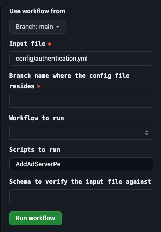

## GitOps

### Prerequisite

We need a Ubuntu VM, which is configured as a self-hosted runner. This VM, should have network connectivity to the
Prism-Central and the clusters in consideration.
Click [here](https://docs.github.com/en/actions/hosting-your-own-runners/managing-self-hosted-runners) to read how to
configure self-hosted runner to your repository.

### Required parameters

Read about the supported workflows to run the framework [here](../README.md#running-existing-workflows).

### Github pipelines

We can use **Github workflows/ pipelines** to manage GitOps i.e using this repository to manage Infrastructure as a
Code (IaaC), that gets triggered from Github.
> A **Github workflow** is a configurable automated process that will run one or more jobs. Workflows are defined by a
> YAML file checked in to your repository and will run when triggered by an event in your repository, or they can be
> triggered manually, or at a defined schedule.

### How to auto-trigger pre-defined workflows

Pre-defined ZTF workflows are triggered by the approval of a PR containing the configuration file changes.
Here is the step-by-step guide.

- Create a new branch/ use an existing branch other than `main`.
- Create and modify any of the following example configuration files: [config/pod-deploy.yml](example-configs/pod-configs/pod-deploy.yml)
  , [config/pod-management-deploy.yml](example-configs/pod-configs/pod-management-deploy.yml), [config/pod-management-config.yml](example-configs/pod-configs/pod-management-config.yml)
  , [config/pod-config.yml](example-configs/pod-configs/pod-config.yml), [config/create-vm-workloads.yml](example-configs/workflow-configs/create-vm-workloads.yml)
  , [config/edge-ai.json](example-configs/workflow-configs/edge-ai.json), [config/pc-deploy.yml](example-configs/workflow-configs/pc-deploy.yml), [config/pc-config.yml](example-configs/workflow-configs/pc-config.yml), [config/cluster-config.yml](example-configs/workflow-configs/cluster-config.yml) with the corresponding configuration changes for your environment.
- Save the files in the config directory.
- Create a **Pull-Request (PR)** from this branch to **main**.
- The **PR approval** will trigger the corresponding workflows and run the deployments and/or configurations.

Below are the details of workflows that are triggered by the
configuration files changes.

- **Imaging workflow** - This Github workflow gets triggered when the file [config/pod-deploy.yml](example-configs/pod-configs/pod-deploy.yml) is part
  of the PR. This GitHub workflow will setup the necessary Python environment and calls the framework as below
    ```sh
    > python main.py --workflow imaging -f config/pod-deploy.yml
    ```
- **Pod config workflow** - This Github workflow gets triggered when the file [config/pod-config.yml](example-configs/pod-configs/pod-config.yml) is
  part of the PR. This GitHub workflow will setup the necessary Python environment and calls the framework as below
    ```sh
    > python main.py --workflow pod-config -f config/pod-config.yml
    ```
- **Deploy Management PC workflow** - This Github workflow gets triggered when the file [config/pod-management-deploy.yml](example-configs/pod-configs/pod-management-deploy.yml) is
  part of the PR. This GitHub workflow will setup the necessary Python environment and calls the framework as below
    ```sh
    > python main.py --workflow deploy-management-pc -f config/pod-management-deploy.yml
    ```
- **Config Management PC workflow** - This Github workflow gets triggered when the file [config/pod-management-config.yml](example-configs/pod-configs/pod-management-config.yml) is
  part of the PR. This GitHub workflow will setup the necessary Python environment and calls the framework as below
    ```sh
    > python main.py --workflow config-management-pc -f config/pod-management-config.yml
    ``` 
- **Deploy PC workflow** - This Github workflow gets triggered when the file [config/pc-deploy.yml](example-configs/workflow-configs/pc-deploy.yml) is
  part of the PR. This GitHub workflow will setup the necessary Python environment and calls the framework as below
    ```sh
    > python main.py --workflow deploy-pc -f config/pc-deploy.yml
    ```
- **Config PC workflow** - This Github workflow gets triggered when the file [config/pc-config.yml](example-configs/workflow-configs/pc-config.yml) is
  part of the PR. This GitHub workflow will setup the necessary Python environment and calls the framework as below
    ```sh
    > python main.py --workflow config-pc -f config/pc-config.yml
    ```  
- **Config Cluster workflow** - This Github workflow gets triggered when the file [config/cluster-config.yml](example-configs/workflow-configs/cluster-config.yml) is
  part of the PR. This GitHub workflow will setup the necessary Python environment and calls the framework as below
    ```sh
    > python main.py --workflow config-cluster -f config/cluster-config.yml
    ```    
- **VM workloads workflow** - This Github workflow gets triggered when the
  file [config/create-vm-workloads.yml](example-configs/workflow-configs/create-vm-workloads.yml) is part of the PR. This Github workflow will setup the
  necessary Python environment and calls the framework as below
    ```sh
    > python main.py --workflow calm-vm-workloads -f config/create-vm-workloads.yml
    ```
- **Edge AI workload workflow** - This Github workflow gets triggered when the file [config/edge-ai.json](example-configs/workflow-configs/edge-ai.json)
  is part of the PR. This GitHub workflow will setup the necessary Python environment and calls the framework as below
    ```sh
    > python main.py --workflow calm-edgeai-vm-workload -f config/edge-ai.json
    ```

> Note: The PR cannot contain configuration changes in multiple files, as they conflict with one another. In the scenario where multiple configuration changes exist, only the first one in the below workflow chain would be triggered.
> **Imaging workflow -> Pod Management Deploy -> Pod Management Config -> Pod config workflow -> Deploy PC workflow -> Config PC workflow -> Config Cluster -> VM workloads workflow -> Edge AI workload workflow**.

## Snapshots of auto-trigger

- Modify any of the files configured for auto-trigger (**config/pod-deploy.yml/ config/pod-config.yml/ config/pod-management-deploy.yml/
  config/pod-management-config.yml config/create-vm-workloads.yml**) and commit to a new branch.  
  
- Create a PR.  
  
- Get approval for the PR. This triggers the workflow.  
  
- Then monitor the workflow from `Actions` tab under `Trigger Python Workflows` section, click on latest workflow run
  and expand `Run python script` for streaming logs.  
  
- The logs and input config file, used for the run will be pushed back to the branch that triggered the run.  
  

### How to trigger individual scripts using Github UI

- This workflow can be manually triggered from the `Actions` Tab in Github.  
    
  

> Note we can use the above method to also select the pre-defined workflows to run