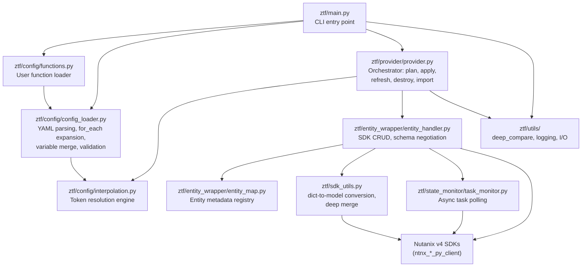
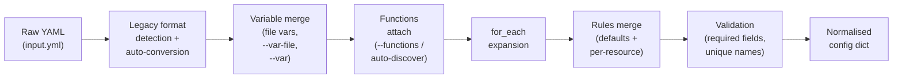
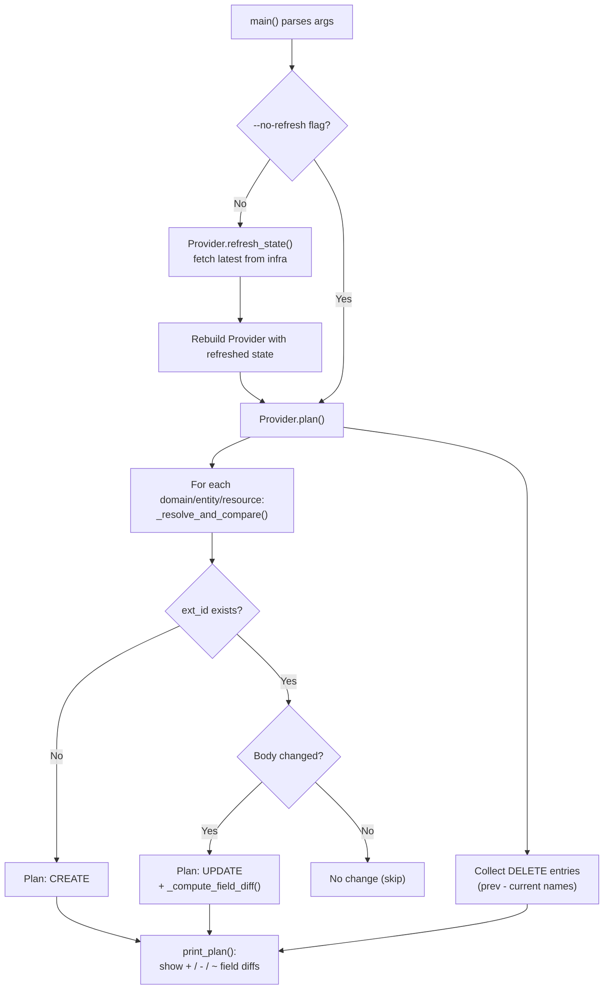
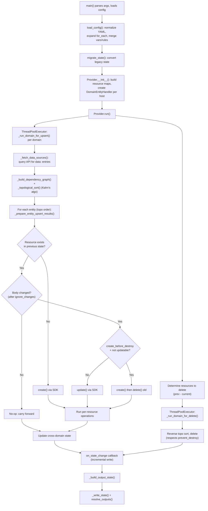
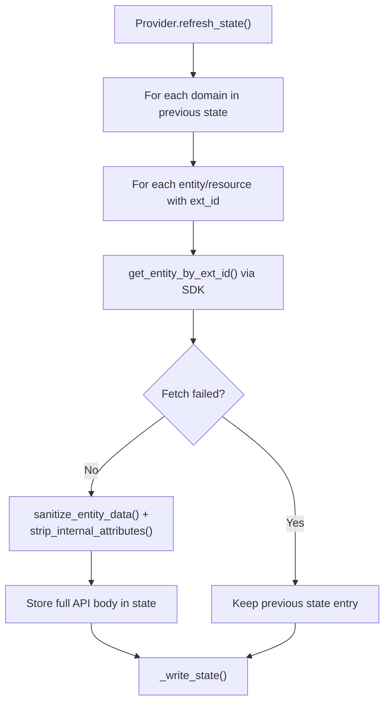
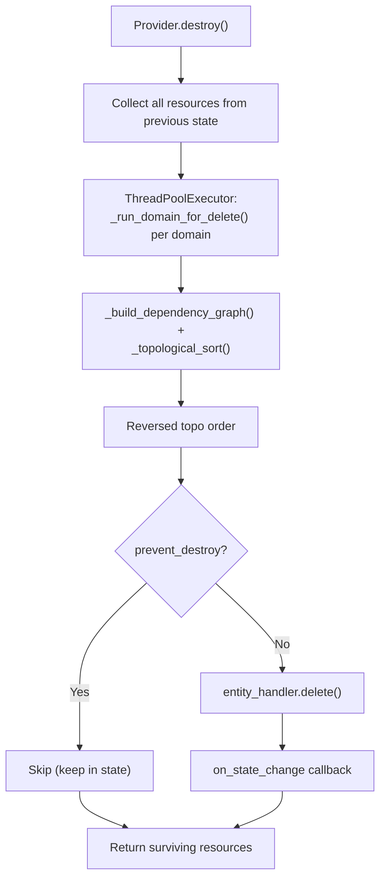
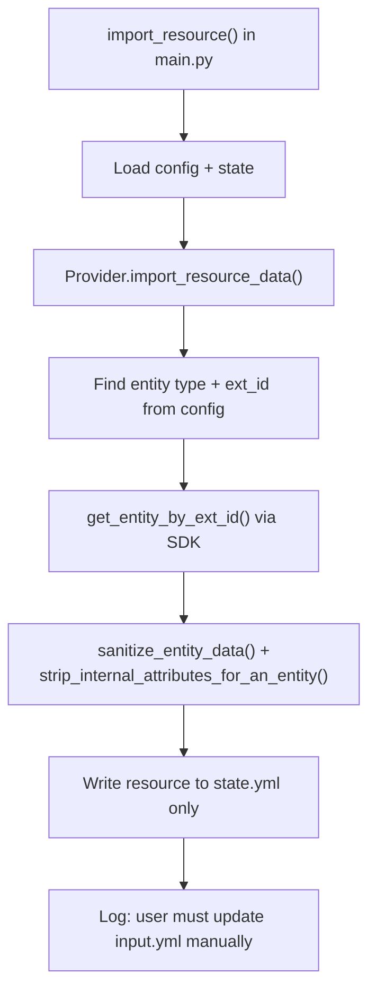

# ZTF Developer Guide

This document is for contributors and developers who want to understand,
modify, or extend the ZTF codebase. For end-user documentation, see
[Getting Started](getting-started.md),
[Configuration Reference](configuration-reference.md), and
[Advanced Topics](advanced-topics.md). For a quick overview, see the
[README](../README.md).

---

## Architecture Overview

ZTF follows a layered architecture where the CLI drives configuration loading,
which feeds into the Provider orchestrator, which delegates individual SDK
calls to domain-specific entity handlers.



---

## Module Structure

```
ztf/
  __init__.py                         # Package init, __version__
  main.py                             # CLI: argparse, state I/O, command dispatch
  generate_examples.py                # CLI subcommand: generate example YAML/MD
  config/
    __init__.py
    config_loader.py                  # YAML normalization, for_each, variable merge
    functions.py                      # User-defined {fn.*} function loader
    interpolation.py                  # {scope.path} token engine
  provider/
    __init__.py
    provider.py                       # Orchestrator: plan, run, destroy, refresh, import
  entity_wrapper/
    __init__.py
    entity_handler.py                 # DomainEntityHandler: SDK CRUD, schema negotiation
    entity_map.py                     # Static entity metadata (per-entity SDK config)
    multi_namespace_compatibility_map.json  # Schema compat map for version negotiation
  sdk_utils.py                        # dict_to_sdk_model, deep_merge, call_api_with_body
  state_monitor/
    __init__.py
    state_monitor.py                  # Abstract base class for polling
    task_monitor.py                   # PcTaskMonitor: poll Prism task status
  utils/
    __init__.py
    deep_compare.py                   # Recursive dict/list comparison
    utils.py                          # Logging, file I/O, exception formatting
```

---

## CLI System

### Entry Point

ZTF uses [Click](https://click.palletsprojects.com/) for its CLI, defined
in `ztf/main.py`. A top-level `@click.group()` named `cli` registers each
subcommand. Shared options (`--input`, `--global-file`, `--state`, etc.)
are applied via the `_common_io_options` decorator.

### Commands

| Command                      | Default | Description                                                |
| ---------------------------- | ------- | ---------------------------------------------------------- |
| `apply`                      | Yes     | Create, update, and delete resources to match config       |
| `plan`                       |         | Dry-run showing what would change without applying         |
| `refresh`                    |         | Sync state file from live infrastructure                   |
| `init`                       |         | Create an empty `state.yml`                                |
| `import <resource> <domain>` |         | Import an existing resource into state                     |
| `destroy`                    |         | Delete all managed resources                               |
| `examples`                   |         | Generate YAML example configs and Markdown reference docs  |
| `repl`                       |         | Interactive REPL or scripted execution with config context |

### CLI Flags

**Shared flags** (applied via `_common_io_options` to `apply`, `plan`,
`refresh`, `destroy`, `import`):

| Flag            | Short | Default         | Description                                                                    |
| --------------- | ----- | --------------- | ------------------------------------------------------------------------------ |
| `--input`       | `-i`  | `input.yml`     | Path to entity configuration file                                              |
| `--global-file` | `-g`  | `global.yml`    | Path to global SDK configuration file                                          |
| `--state`       | `-s`  | `state.yml`     | Path to state file                                                             |
| `--parallel`    | `-p`  | `cpu_count + 4` | Maximum number of parallel workers                                             |
| `--var`         |       | `[]`            | Variable override: `--var 'key=value'` (repeatable)                            |
| `--var-file`    |       | `[]`            | Path to a YAML variable file (repeatable)                                      |
| `--functions`   |       | `None`          | Path to Python functions file for `{fn.*}` tokens (auto-discovered if omitted) |

**Command-specific flags:**

| Flag             | Commands           | Default | Description                                                   |
| ---------------- | ------------------ | ------- | ------------------------------------------------------------- |
| `--output-file`  | `apply`            | `None`  | Path to write resolved outputs after apply (YAML or JSON)     |
| `--no-refresh`   | `plan`, `apply`, `destroy` | `false` | Skip automatic state refresh before action              |
| `--strict`       | `plan`, `apply`, `destroy` | `false` | Fail on refresh errors instead of proceeding with stale state |
| `--auto-approve` | `apply`, `destroy` | `false` | Skip interactive confirmation prompt                          |
| `--target`       | `destroy`          | `[]`    | Destroy only the named resource(s) (repeatable)               |
| `--force`        | `init`             | `false` | Overwrite existing state file without prompting               |
| `--file`         | `import`           | `None`  | YAML file listing resources to bulk-import                    |
| `--exec`         | `repl`             | `None`  | Execute one-line code and exit                                |
| `--script`       | `repl`             | `None`  | Run a Python script and exit                                  |

### Init Arguments

- `--state` / `-s` -- Path to state file (default: `state.yml`). Parent
  directories are created automatically if they do not exist.
- `--force` / `-f` -- Overwrite existing state file without prompting
  (backs up the existing file first).

### Import-Specific Arguments

- `resource_name` (positional) -- Name of the resource in `input.yml`.
- `domain_name` (positional) -- Domain name (key under `domains:`).
- `--file` -- YAML file listing resources to bulk-import
  (format: list of `{resource_name, domain_name}` entries). Mutually
  exclusive with positional arguments.

### Examples Arguments

- `--namespace` -- Generate examples for a single namespace only.
- `--output-dir` -- Output directory for the generated examples.

### Repl Arguments

The `repl` command uses `_repl_io_options` (a subset of the shared flags:
`--input`, `--global-file`, `--var`, `--var-file`).

- `--exec CODE` -- Execute one-line code and exit.
- `--script PATH` -- Run a Python script and exit.

`--exec` and `--script` are mutually exclusive. If neither is provided,
an interactive REPL session starts with the config context and data
namespace pre-loaded.

---

## Confirmation Prompt

**Location:** `ztf/main.py` -- `_confirm_action()`

Before executing `apply` or `destroy`, ZTF displays the planned changes and
prompts the user for explicit confirmation. This prevents accidental
infrastructure modifications.

### How It Works

1. After computing the plan, ZTF prints all create/update/delete/operations
   entries with field-level diffs.
2. A Terraform-style summary line shows counts
   (e.g. `Plan: 2 to create, 1 to update, 0 to delete.`).
3. If there are any changes, `_confirm_action()` prompts:

```
 Do you want to perform these actions?
   ZTF will perform the actions described above.
   Only 'yes' will be accepted to apply.

   Enter a value:
```

4. Only the exact string `"yes"` (case-insensitive) proceeds. Any other input,
   `Ctrl+C`, or `EOF` cancels the operation.

### Skipping the Prompt

Pass `--auto-approve` to bypass the confirmation for CI/CD pipelines:

```bash
ztf apply --auto-approve
ztf destroy --auto-approve
```

### No Prompt When No Changes

If `plan` shows zero create/update/delete/operations, `apply` exits
immediately without prompting -- there is nothing to do.

---

## Interpolation Engine

**Location:** `ztf/config/interpolation.py`

The interpolation engine resolves `{scope.path}` tokens in any YAML value.
It supports nested dict traversal, type-preserving full-string replacement,
and multiple scopes for different resolution stages.

### Token Syntax

Tokens use the pattern `{scope.path}` (regex: `\{([^}]+)\}`).

| Pattern                                             | Resolves To                                                   | Available During                 |
| --------------------------------------------------- | ------------------------------------------------------------- | -------------------------------- |
| `{var.name}`                                        | Variable value from `variables:` section or `--var` overrides | Config load + apply              |
| `{each.key}`                                        | Current `for_each` iteration key                              | Config load (for_each expansion) |
| `{each.value}`                                      | Current `for_each` iteration value                            | Config load (for_each expansion) |
| `{each.value.field}`                                | Nested field from `for_each` value                            | Config load (for_each expansion) |
| `{fn.name(args)}`                                   | User-defined Python function result                           | Config load + apply              |
| `{data.entity.name.data.0.field}`                   | Field from first data source result                           | Apply only                       |
| `{data.entity.name.metadata.totalAvailableResults}` | Total results count                                           | Apply only                       |
| `{resource_name.ext_id}`                            | `ext_id` of a resource in the same domain                     | Apply only                       |
| `{resource_name.body.field}`                        | Body field of a resource in the same domain                   | Apply only                       |
| `{domain.resource_name.field}`                      | Cross-domain resource reference                               | Apply only                       |

### InterpolationContext

The `InterpolationContext` class holds all scopes needed for token resolution:

| Slot             | Source                                               | Purpose                                               |
| ---------------- | ---------------------------------------------------- | ----------------------------------------------------- |
| `variables`      | `variables:` section + `--var` overrides + var-files | Static key-value pairs                                |
| `for_each`       | Current iteration during `for_each` expansion        | `{"key": ..., "value": ...}`                          |
| `resource_state` | Resources in the same domain (grows during apply)    | Runtime state for `{res.ext_id}`                      |
| `data_cache`     | Data source query results                            | Runtime data for `{data.entity.name.data.0.field}`    |
| `domain_states`  | Resources from other domains                         | Cross-domain references                               |
| `current_domain` | Name of the domain being processed                   | Used to exclude self from cross-domain                |
| `functions`      | User-defined Python callables from `functions.py`    | `{name: callable}` dict for `{fn.*}` token resolution |

### Resolution Modes

- `**strict=False`\*\* (default): Unresolvable tokens are left as-is. Used
  during config loading and plan mode where not all runtime state is available.
- `**strict=True**`: Unresolvable tokens raise `ValueError`. Used during
  apply mode to catch missing references before API calls.

### Type Preservation

When a `{token}` is the **entire** string value (a full-match), the resolved
Python type is preserved (int, dict, list, bool, etc.). When embedded in a
larger string like `"prefix-{var.x}-suffix"`, the result is always a string
via `str()` conversion.

**Example:**

```yaml
variables:
  port: 8080
  tags:
    env: prod

resources:
  my_vm:
    body:
      port: "{var.port}" # Resolves to int 8080 (type preserved)
      name: "vm-{var.port}" # Resolves to string "vm-8080" (embedded)
      tags: "{var.tags}" # Resolves to dict {"env": "prod"} (type preserved)
```

### Resource Dependency Inference

The `extract_resource_refs()` function scans token strings for
`{resource_name.field}` patterns and returns the set of referenced resource
names. This is used by the dependency graph builder to infer ordering without
explicit `depends_on` declarations. Scoped prefixes (`var`, `each`, `data`,
`fn`) are excluded from dependency inference (see `_SCOPED_PREFIXES` in
`interpolation.py`).

---

## Variable System

### Variable Sources (Precedence Order)

Variables are merged in the following order (later sources override earlier):

1. `**variables:` section\*\* in `input.yml`
2. `**ztfvars.yml`\*\* -- auto-loaded if present in the working directory
3. `***.auto.ztfvars.yml**` -- auto-loaded (sorted alphabetically)
4. **Explicit `--var-file` paths** -- loaded in the order specified
5. `**--var 'key=value'`\*\* flags -- highest precedence

### Auto-Loaded Variable Files

**Location:** `ztf/main.py` -- `discover_auto_var_files()`

Mirrors Terraform's `terraform.tfvars` / `*.auto.tfvars` convention:

- `ztfvars.yml` -- Primary secrets/variables file (typically in `.gitignore`).
- `*.auto.ztfvars.yml` -- Additional files sorted alphabetically.

These are automatically discovered and loaded before any explicit `--var-file`
paths. Log messages confirm which files are auto-loaded.

### `--var` Parsing

The `parse_var_string()` function in `config_loader.py` parses
`--var 'key=value'` CLI arguments. The format must contain `=`; otherwise
a `ValueError` is raised.

---

## Config Loading Pipeline

**Location:** `ztf/config/config_loader.py`



### Pipeline Stages

1. **Legacy Format Detection**: If the config contains `pc_domains` (old
   list format) instead of `domains`, it is automatically converted by
   `convert_legacy_config()`.
2. **Variable Merge**: Variables from all sources are merged into a single
   dict. A variable-only `InterpolationContext` is created for resolving
   `{var.*}` tokens in connection settings and resource bodies.
3. **Functions Attach**: If a `functions` dict was passed to
   `load_config()` (resolved by `resolve_functions_file()` in `main.py`),
   it is stored in the returned config and made available to every
   `InterpolationContext` for `{fn.*}` token resolution.
4. `**for_each` Expansion\*\*: Resources with a `for_each` map are expanded
   into individual resources. Each iteration creates a new
   `InterpolationContext` with `{each.key}` and `{each.value}` scopes.
   The resource name itself can contain tokens
   (e.g. `"container-{each.key}"`).
5. **Rules Merge**: Per-resource `rules` are merged with global
   `defaults.rules`. The default rules are:
6. **Validation**: `_validate_resource_names()` ensures resource names are
   unique within a domain across all entity types. Required connection
   fields (`username`, `password`) are validated per domain.

### Key Functions

| Function                                                       | Purpose                                                               |
| -------------------------------------------------------------- | --------------------------------------------------------------------- |
| `load_config(raw_config, var_overrides, var_files, functions)` | Main entry: runs the full pipeline, accepts optional `functions` dict |
| `is_legacy_format()`                                           | Detect `pc_domains` list format                                       |
| `convert_legacy_config()`                                      | Convert legacy to domain-grouped format                               |
| `_expand_for_each()`                                           | Expand `for_each` map into individual resources                       |
| `_validate_resource_names()`                                   | Ensure resource names are unique within a domain                      |
| `migrate_state()`                                              | Convert legacy state format to new dict format                        |
| `parse_var_string()`                                           | Parse `--var 'key=value'` strings                                     |

---

## `for_each` Expansion

**Location:** `ztf/config/config_loader.py`

The `for_each` feature allows creating multiple resources from a single
template, similar to Terraform's `for_each` meta-argument.

### Syntax

```yaml
resources:
  storage_container:
    "container-{each.key}":
      for_each:
        dev:
          name: "dev-storage"
          rf: 2
        prod:
          name: "prod-storage"
          rf: 3
      body:
        name: "{each.value.name}"
        replicationFactor: "{each.value.rf}"
```

### Expansion Result

The above expands into two concrete resources:

- `container-dev` with `name: "dev-storage"`, `replicationFactor: 2`
- `container-prod` with `name: "prod-storage"`, `replicationFactor: 3`

### Available Tokens

| Token                | Resolves To                              |
| -------------------- | ---------------------------------------- |
| `{each.key}`         | Current map key (e.g. `"dev"`, `"prod"`) |
| `{each.value}`       | Full map value (dict or scalar)          |
| `{each.value.field}` | Nested field from the map value          |

Both the resource name and the body can reference `each` tokens. Variables
(`{var.*}`) and custom functions (`{fn.*}`) are also available during
expansion.

---

## Lifecycle Rules

**Location:** `ztf/config/config_loader.py` (defaults), `ztf/provider/provider.py` (enforcement)

Each resource can define `rules` that control lifecycle behaviour. Rules are
merged with global `defaults.rules`, with per-resource rules taking
precedence.

### `prevent_destroy`

```yaml
rules:
  prevent_destroy: true
```

When enabled, ZTF skips deletion of this resource during `apply` (when
removed from config) and `destroy`. The resource is kept in state and a
warning is logged. This protects critical infrastructure from accidental
deletion.

**Enforcement:** `_prepare_delete_entity_results()` in `provider.py` checks
`prevent_destroy` before submitting delete operations.

### `ignore_changes`

```yaml
rules:
  ignore_changes:
    - "config.pulseStatus"
    - "networkConfig"
```

Fields listed here are stripped from both the previous and current body before
comparison. This prevents updates triggered by fields that are managed
externally or change frequently (e.g. timestamps, status fields).

**Enforcement:** `_apply_ignore_changes()` in `provider.py` recursively strips
matching fields using dotted-path prefix matching. For example,
`"config.pulseStatus"` also matches `"config.pulseStatus.isEnabled"`.

### `create_before_destroy`

```yaml
rules:
  create_before_destroy: true
```

For entities where update is not supported (`update_supported: False` in
entity_map), this rule creates the new resource first, then deletes the old
one. This ensures zero downtime during replacement.

**Enforcement:** `_prepare_entity_upsert_results()` in `provider.py` checks
both `create_before_destroy` and `update_supported` to determine if a
replace workflow is needed.

---

## Dependency Management

**Location:** `ztf/provider/provider.py`

### Dependency Sources

Dependencies between resources are determined from two sources:

1. **Implicit (interpolation tokens)**: The `extract_resource_refs()` function
   scans each resource body for `{resource_name.field}` patterns. If
   `resource_name` matches a known resource in the same domain, an edge is
   added to the dependency graph.
2. **Explicit (`depends_on`)**: Resources can declare explicit dependencies:

```yaml
resources:
  subnet:
    my_subnet:
      depends_on:
        - my_vpc
      body:
        vpcReference: "{my_vpc.ext_id}"
```

### Dependency Graph Construction

`_build_dependency_graph()` builds an entity-type-level directed graph:

1. Maps each resource name to its entity type.
2. Scans bodies for interpolation references and `depends_on` entries.
3. Creates entity-to-entity edges (not resource-to-resource) for ordering.
4. Returns `(graph, in_degree)` for topological sorting.

### Topological Sort (Kahn's Algorithm)

`_topological_sort()` implements Kahn's algorithm:

1. Start with all entities that have zero in-degree.
2. Process entities in BFS order, decrementing in-degrees.
3. If not all entities are processed, a **circular dependency** is detected
   and `ValueError` is raised.

### Execution Order

- **Create/Update**: Entities are processed in topological order so that
  dependencies are created before dependents.
- **Delete**: Entities are processed in **reverse** topological order so that
  dependents are deleted before their dependencies.
- The entity order is persisted in state as `_entity_order` for consistent
  delete ordering even when the config has changed.

---

## Plan and Diff System

**Location:** `ztf/provider/provider.py`, `ztf/utils/deep_compare.py`, `ztf/main.py`

### Plan Flow



### Plan Steps

1. **Automatic Refresh**: By default, `plan` refreshes state from
   infrastructure before computing diffs (unless `--no-refresh`).
2. **Delete Detection**: Compares `previous_domain_resource_name_map` vs
   `domain_resource_name_map` to find resources removed from config.
3. **Create/Update Detection**: For each resource, `_resolve_and_compare()`
   resolves interpolation (lenient mode), applies `ignore_changes`, and
   compares bodies using `deep_equal()`.
4. **Operations**: All operations defined on resources are always shown as
   `[OPERATIONS]` in the plan.

### Field-Level Diff

`_compute_field_diff(prev_body, curr_body)` computes a structured diff:

```python
{
    "added": {"newField": "value"},
    "removed": {"oldField": "value"},
    "changed": {"name": {"old": "foo", "new": "bar"}},
}
```

### Deep Comparison

`deep_equal()` in `deep_compare.py` recursively compares two structures:

- **Dicts**: Compared key-by-key (order-independent).
- **Lists**: Compared element-by-element with order-independent matching
  (each element in `a` must match exactly one element in `b`).
- `**ignore_keys`\*\*: SDK metadata fields like `$objectType` and
  `$dataItemDiscriminator` are excluded from comparison at every nesting
  level.

### Plan Output Format

`print_plan()` in `main.py` displays changes with Terraform-style formatting:

```
  [CREATE] lab1 > subnet/my_subnet
  [UPDATE] lab1 > vm/my_vm
    + newField: value
    - removedField: value
    ~ changedField: old_value -> new_value
  [DELETE] lab1 > vm/old_vm
  [OPERATIONS] lab1 > vm/my_vm: power_on

Plan: 1 to create, 1 to update, 1 to delete, 1 operation(s) to run.
```

---

## State File Management

**Location:** `ztf/main.py`

### State File Format

The state file (`state.yml`) records all managed resources:

```yaml
domains:
  <domain_name>:
    host: <pc_ip_or_hostname>
    _entity_order: # Persisted topological order for deletes
      - subnet
      - vm
    resources:
      <entity_type>:
        <resource_name>:
          ext_id: <uuid>
          body: <full_api_response_body>
          params: # optional, for sub-entities
            <parent_id_param>: <value>
```

### State File Locking

**Class:** `StateFileLock` -- a cross-platform context manager for advisory
file locking.

| Platform   | Mechanism                                                                   |
| ---------- | --------------------------------------------------------------------------- |
| Unix/macOS | `fcntl.flock(LOCK_EX)` for exclusive lock, `fcntl.flock(LOCK_UN)` to unlock |
| Windows    | `msvcrt.locking(LK_LOCK)` to lock, `msvcrt.locking(LK_UNLCK)` to unlock     |

The lock prevents concurrent ZTF processes from corrupting the state file.
The lock file is opened in `"a+"` mode (append + read) so it is created if
missing. If the file is read-only, it falls back to `"r"` mode.

**Usage pattern:**

```python
with StateFileLock(state_path):
    with open(state_path, "w", encoding="utf-8") as fh:
        yaml.safe_dump(state_data, fh, sort_keys=False)
```

### Safety Mechanisms

| Feature                        | Implementation                                                              |
| ------------------------------ | --------------------------------------------------------------------------- |
| **Advisory locking**           | `StateFileLock` uses `fcntl.flock(LOCK_EX)` to prevent concurrent writes    |
| **Automatic backups**          | `_write_state()` creates `.bak` copy before every write via `shutil.copy2`  |
| **Read-only permissions**      | State file set to `0o444` (Unix) or `S_IREAD` (Windows) after writes        |
| **Writable on demand**         | `_set_writable()` called before modifications, then `_set_readonly()` after |
| **Per-resource writes**        | `on_state_change` callback persists state after every resource operation     |
| **Domain failure isolation**   | Failed domain preserves its previous state (not cleared)                    |
| **Graceful interrupt**         | First Ctrl+C stops new ops, saves partial state; second Ctrl+C force-quits |

### State Write Flow

1. If the state file exists, make it writable and create a `.bak` backup.
2. Acquire the `StateFileLock`.
3. Open and write with `yaml.safe_dump(sort_keys=False)`.
4. Release the lock.
5. Set the file to read-only.

### State Migration

Legacy state formats (flat `pc_domains` list) are automatically detected and
converted by `migrate_state()` in `config_loader.py`. The migration is
idempotent -- if the state already has a `domains` key, it is returned
unchanged.

---

## Data Sources

**Location:** `ztf/provider/provider.py` -- `_fetch_data_sources()`

Data sources allow querying existing infrastructure for use in interpolation
without managing those resources.

### Configuration

```yaml
domains:
  lab1:
    data:
      cluster:
        my_cluster:
          filter: "name eq 'grove'"
          select: "extId,name"
    resources:
      subnet:
        my_subnet:
          body:
            clusterExtId: "{data.cluster.my_cluster.data.0.extId}"
```

### How It Works

1. During apply, `_fetch_data_sources()` queries the API for each data source
   using list args (`filter`, `select`, `orderby`, `limit`, `page`).
2. Results are sanitized (`sanitize_entity_data` + `strip_internal_attributes`)
   and cached as `{data: [...], metadata: {totalAvailableResults: N}}`.
3. The cache is made available to the interpolation engine as the `data_cache`
   scope, enabling `{data.entity.name.data.0.field}` tokens.
4. Data sources are **read-only** -- they are never created, updated, or
   deleted by ZTF.

---

## Outputs System

**Location:** `ztf/provider/provider.py` -- `resolve_outputs()`, `ztf/main.py`

Outputs allow extracting values from the final resource state after apply.

### Configuration

```yaml
outputs:
  vm_ip:
    value: "{my_vm.body.nics.0.ipAddress}"
    description: "IP address of the VM"
  subnet_id:
    value: "{my_subnet.ext_id}"
    description: "Subnet external ID"
```

### How It Works

1. After `apply` completes, `resolve_outputs()` builds a combined resource
   state across all domains and resolves each output's `value` using the
   interpolation engine.
2. Resolved outputs are logged to the console.
3. If `--output-file` is specified, outputs are written to a YAML or JSON
   file (determined by file extension).

---

## Resource Lifecycle

### Apply Flow



### Create

1. If the entity has a `filter_format` in `entity_map`, ZTF first checks
   if a matching entity already exists (idempotency check).
2. Schema negotiation filters the body for the target PC version.
3. The SDK `create` method is called. If the response is a task reference,
   `PcTaskMonitor` polls until completion.
4. The created entity's `ext_id` is extracted from the task response.

### Update

1. **GET current state** from the API.
2. **Strip read-only fields** (system fields + schema-derived `readOnly`
   fields from the compatibility map).
3. **Deep-merge** the user's update body into the current state.
4. **Schema negotiation** filters the merged body for version compatibility.
5. If **etag is required**, fetch the current etag and set `If-Match` header.
6. Call the SDK `update` method.
7. Clean up the `If-Match` header from shared `ApiClient` defaults.

### Delete

1. Resources to delete are identified by comparing previous state names
   against current config names.
2. Domains removed from config have all their resources deleted.
3. Deletion proceeds in **reverse topological order**.
4. `prevent_destroy` rules are checked before each deletion.
5. Failed deletions keep the resource in state (surviving resources).

### Replace (`create_before_destroy`)

For entities that don't support updates:

1. Create the new resource first.
2. Delete the old resource (by its previous `ext_id`).
3. If creation succeeds but deletion fails, the new resource is kept in state
   and a warning is logged.

### Operations

Operations are post-create/update actions (e.g. power on a VM, attach a disk):

1. Each resource can define an `operations` list with `type`, `params`,
   and `body`.
2. The target resource's `ext_id` is auto-injected into the first ID
   parameter of the SDK method.
3. Operations are executed after the resource is created/updated.

### Refresh



### Destroy



### Import



Import fetches the current state of an existing resource and writes it to
`state.yml`. The resource must already be defined in `input.yml` with an
`ext_id` so ZTF knows what to fetch. `input.yml` is **not** modified -- the
user is responsible for writing the matching config manually.

---

## Parallel Execution

**Location:** `ztf/provider/provider.py`

ZTF uses `concurrent.futures.ThreadPoolExecutor` at two levels:

1. **Domain-level**: Multiple domains are processed in parallel during
   apply/destroy. Each domain runs in its own thread.
2. **Entity-level**: Within a domain, resources of the same entity type
   are created/updated/deleted in parallel.

The maximum worker count defaults to `cpu_count + 4` and can be overridden
with `--parallel`.

### Cross-Domain State

During parallel apply, `domain_resource_state` is updated after each domain
completes. This allows cross-domain interpolation (`{domain.resource.field}`)
to work for domains that have already finished, though ordering is
non-deterministic.

### Thread Naming

`set_entity_thread_name()` sets the thread name before execution (e.g.
`"lab1-subnet-create"`) for easier debugging in logs.

---

## SDK Integration

### DomainEntityHandler

**Location:** `ztf/entity_wrapper/entity_handler.py`

`DomainEntityHandler` is the bridge between ZTF's declarative model and the
Nutanix SDK APIs. One handler instance is created per unique PC host.

**Initialization flow:**

1. For each entity in config + state, visit dependencies (DFS)
2. `_initialize_config()`: create one `Configuration` per SDK package
3. `_initialize_client()`: create one `ApiClient` per SDK package

- Enable `allow_version_negotiation=True` where supported
- Monkey-patch `negotiate_version` for pre-v4.2 PC compatibility
- Special-case IAM SDK (set negotiated version manually)

4. `_initialize_entity_crud_mapping()`: derive CRUD method names from conventions
   (e.g. entity `storage_container` -> `create_storage_container`,
   `update_storage_container_by_id`, etc.)

### Handler Sharing

When multiple domains point to the same PC host, they share a single
`DomainEntityHandler` instance to avoid duplicate SDK connections.

### Schema Negotiation (`_negotiate_schema`)

Before sending a create/update body to the API, ZTF filters it against the
multi-namespace compatibility map. This map records which request body fields
are available in which API versions.

**Flow:**

1. Look up the entity's namespace in the compat map
2. Convert the SDK method name to camelCase operationId
3. Get the request schema for that operation
4. Recursively walk the body and strip fields not present in the target
   PC version (based on `versions` list per field)
5. Also strip `readOnly` fields from request bodies
6. Handle `oneOf` variants by matching on `$objectType`

This enables a single codebase to work across multiple PC versions without
sending unsupported fields.

### dict-to-model Conversion (`sdk_utils.py`)

Some SDKs require proper model instances rather than raw dicts. The
`call_api_with_body()` / `dict_to_sdk_model()` functions in `sdk_utils.py`:

1. Parse the SDK method's docstring to discover the expected model class
2. Import the model class dynamically
3. Use `swagger_types` + `attribute_map` to map dict keys to model attributes
4. Fall back to passing the raw dict if conversion fails

### Etag-Based Optimistic Concurrency

For update and delete operations on entities that require it:

1. `_is_etag_required()` checks `etag_required` dict in entity_map metadata
   (with legacy `delete_etag_required` fallback)
2. `_get_tag()` fetches the current entity and extracts the ETag header
3. The ETag is set as `If-Match` default header before the update/delete call
4. After the call, the `If-Match` header is removed from defaults using a
   `threading.Lock()` to prevent races
5. The lock prevents the shared `ApiClient` from leaking the header to
   concurrent operations

### PcTaskMonitor

**Location:** `ztf/state_monitor/task_monitor.py`

Many Nutanix API operations are asynchronous. When an SDK call returns a task
reference (`prism.v4.config.TaskReference`), `_execute_method_with_task_monitor()`:

1. Creates a `PcTaskMonitor` with the task's `ext_id`
2. Polls `TasksApi.get_task_by_id()` at 5-second intervals
3. Checks for terminal states: `SUCCEEDED`, `FAILED`, `CANCELED`, `SUSPENDED`
4. Times out after 600 seconds (default)
5. On `SUCCEEDED`, extracts the created entity's `ext_id` from:

- `entities_affected[0]["{entity}_ext_id"]` (preferred)
- `entities_affected[0]["ext_id"]` (fallback)
- `response_data["ext_id"]` (last resort)

### Idempotent Creates (`filter_format`)

Entities with a `filter_format` in `entity_map` support idempotent creation:

```python
"filter_format": "name eq '{name}'"
```

Before creating, ZTF queries the API with the formatted filter. If a matching
entity already exists, the existing `ext_id` is returned and creation is
skipped. This prevents duplicates on re-apply.

### Paginated List

`list_entities()` handles API pagination automatically. It fetches the first
page, checks `total_available_results` from metadata, and continues fetching
pages until all results are collected.

---

## Entity Map and Namespace System

**Location:** `ztf/entity_wrapper/entity_map.py`, `multi_namespace_compatibility_map.json`

### Entity Map Structure

Each entity entry in `entity_map` contains:

| Field                | Description                                                     |
| -------------------- | --------------------------------------------------------------- |
| `sdk_name`           | Python package name (e.g. `"ntnx_clustermgmt_py_client"`)       |
| `namespace`          | API namespace (e.g. `"clustermgmt"`, `"vmm"`, `"iam"`)          |
| `api_class_path`     | API class module path (auto-derived if not set)                 |
| `api_class_name`     | API class name (auto-derived if not set)                        |
| `create_method_name` | SDK create method (default: `"create_{entity}"`)                |
| `update_method_name` | SDK update method (default: `"update_{entity}_by_id"`)          |
| `delete_method_name` | SDK delete method (default: `"delete_{entity}_by_id"`)          |
| `get_method_name`    | SDK get method (default: `"get_{entity}_by_id"`)                |
| `list_method_name`   | SDK list method (default: `"list_{plural_entity}"`)             |
| `method_params`      | Per-operation parameter lists for SDK method calls              |
| `parent_id_param`    | Parent ID parameter for sub-entities (e.g. `"clusterExtId"`)    |
| `filter_format`      | Format string for idempotent create checks                      |
| `etag_required`      | Dict of `{"update": bool, "delete": bool}` for etag enforcement |
| `update_supported`   | Whether the entity supports update operations                   |
| `create_supported`   | Whether the entity supports create operations                   |
| `delete_supported`   | Whether the entity supports delete operations                   |
| `operations`         | List of supported operation method names                        |

### Supported Namespaces

ZTF supports entities across these Nutanix API namespaces:

`aiops`, `clustermgmt`, `datapolicies`, `dataprotection`, `files`, `iam`,
`licensing`, `lifecycle`, `microseg`, `monitoring`, `multidomain`,
`networking`, `objects`, `opsmgmt`, `prism`, `security`, `vmm`, `volumes`

### Compatibility Map

The `multi_namespace_compatibility_map.json` file maps each namespace's
operations to their request/response schemas with version information:

```json
{
  "clustermgmt": {
    "createStorageContainer": {
      "versions": [4.0, 4.1, 4.2],
      "schema": {
        "request": {
          "name": { "type": "string", "versions": [4.0, 4.1, 4.2] },
          "replicationFactor": {
            "type": "integer",
            "versions": [4.0, 4.1, 4.2]
          },
          "newFieldInV42": { "type": "string", "versions": [4.2] }
        }
      }
    }
  }
}
```

---

## Run Results

**Location:** `ztf/provider/provider.py` -- `_write_run_results()`

At the end of each `apply` or `destroy` run, ZTF writes results to
`ztf_run_results.json` (overwritten per run). During execution, results
are accumulated in-memory on the `Provider` instance
(`provider.run_results`) and passed directly to the CLI summary.
The file serves as a per-run audit trail for programmatic consumption.

### Format

```json
{
  "lab1": [
    {
      "entity": "subnet",
      "resource_name": "my_subnet",
      "ext_id": "abc-123",
      "error": null,
      "operation": "create"
    },
    {
      "entity": "vm",
      "resource_name": "my_vm",
      "ext_id": null,
      "error": "API error message",
      "operation": "update"
    }
  ]
}
```

Results are appended across runs, providing a cumulative log of all
operations.

---

## Error Handling

### API Error Formatting

`raise_api_exception()` in `utils.py` parses SDK exception objects and
extracts:

- `status` -- HTTP status code
- `reason` -- HTTP reason phrase
- `message` -- Error message from the exception
- `response` -- Parsed JSON error body with internal attributes stripped

### Failure Recovery

- **Create failure**: Resource is not added to state. Previous state is
  preserved if the resource existed before.
- **Update failure**: Previous state entry is kept unchanged.
- **Delete failure**: Resource survives in state (not removed).
- **Domain failure**: The entire domain's previous state is preserved when
  an unhandled exception occurs in domain processing.
- **Interrupt (Ctrl+C)**: All successfully completed resource operations are
  persisted. In-flight operations are allowed to finish. Remaining resources
  that were not yet attempted appear as pending changes on the next run.

### Incremental State Persistence

**Location:** `Provider._update_partial_results`, `_run_with_graceful_interrupt`

State is persisted after **every individual resource operation** -- not just
after each domain completes. The Provider accumulates results in a thread-safe
`_partial_results` dict (protected by `_partial_results_lock`), and the
`on_state_change` callback writes them to disk after each resource.

This means even if the process is killed mid-run, only the single in-flight
resource operation can be lost. All previously completed resources are safe.

### Graceful Interrupt Handling

**Location:** `ztf/main.py::_run_with_graceful_interrupt`

Both `apply` and `destroy` commands install a custom SIGINT handler via
`_run_with_graceful_interrupt`. The two-stage shutdown works as follows:

1. **First Ctrl+C**: Sets `Provider._shutdown_requested` flag. The
   resource-processing loop checks this flag before each resource and breaks
   early. In-flight SDK calls finish normally. Partial state is saved.
2. **Second Ctrl+C**: Restores the default SIGINT handler, raising
   `KeyboardInterrupt`. The except clause calls `provider.get_partial_state()`
   and writes whatever was accumulated.

---

## Logging System

**Location:** `ztf/main.py`, `ztf/utils/utils.py`

### Log Format

```
%(asctime)s %(levelname)s [%(threadName)s:%(name)s:%(lineno)d] %(message)s
```

This format includes:

- Timestamp
- Log level
- Thread name (useful for parallel domain processing)
- Module name and line number
- Log message

### Handlers

| Handler               | Target                                              | Configuration                                          |
| --------------------- | --------------------------------------------------- | ------------------------------------------------------ |
| `StreamHandler`       | Console (stderr)                                    | Added per-logger in `get_logger()`                     |
| `FileHandler`         | `ztf.log` (or `$ZTF_LOG_FILE` or `$TMPDIR/ztf.log`) | Added per-logger                                       |
| `RotatingFileHandler` | `ztf.log` in working directory                      | 1 MB max, 10 backups, set by `configure_root_logger()` |

### Log File Location

The log file path is determined in order:

1. `ZTF_LOG_FILE` environment variable
2. `tempfile.gettempdir()/ztf.log` (default)
3. `ztf.log` in working directory (for root logger's `RotatingFileHandler`)

### Debug Mode

Debug logging is enabled by setting `config.debug: true` in `global.yml`.

---

## Private API Usage (Monkey Patching)

ZTF accesses three private SDK internals. These are documented here so
future SDK upgrades can be monitored for breakage.

### 1. `_ApiClient__sanitize_for_serialization()`

**Locations:**

- `entity_handler.py` -- in `_prepare_update_body()` to convert the GET
  response to a plain dict for merging with user updates
- `entity_handler.py` -- in `sanitize_entity_data()` to convert SDK model
  objects to serializable dicts for state storage

**Why:** The SDK models are not directly serializable to dicts. The private
`__sanitize_for_serialization()` method on `ApiClient` recursively converts
model instances to JSON-compatible dicts, respecting `attribute_map` and
`swagger_types`.

**Risk:** If the SDK renames or removes this method, both update merging and
state serialization will break.

**Future alternative:** Contribute a public `to_dict()` / `serialize()` method
to the SDK, or maintain a standalone recursive serializer.

### 2. `_ApiClient__default_headers.pop("If-Match")`

**Locations:**

- `entity_handler.py` -- after update calls
- `entity_handler.py` -- after delete calls

**Why:** The SDK's `add_default_header()` adds the `If-Match` ETag to a
shared dict on the `ApiClient`. Since one client is shared across all entities
in a domain, the header must be removed after use to prevent it leaking into
subsequent unrelated API calls.

**Risk:** If the SDK changes how default headers are stored (e.g., moves to
an immutable structure), header cleanup will fail silently, causing
`412 Precondition Failed` errors on subsequent calls.

**Future alternative:** Use per-request headers instead of default headers,
or use separate `ApiClient` instances per concurrent operation.

### 3. Monkey-patched `negotiate_version`

**Location:** `entity_handler.py` -- `_patched_negotiate_version()`

**Why:** The public SDK's `negotiate_version` method omits the
`disable_minimum_supported_version_check` guard, causing version negotiation
to silently abort on servers running below v4.2. The patch mirrors the
internal build which skips the minimum-version check when the flag is set.

**Risk:** If the SDK updates the negotiation logic or renames internal methods
like `__call_api`, this patch will break.

---

## Internal Attribute Stripping

**Location:** `ztf/utils/utils.py`

### `strip_internal_attributes()`

Removes SDK-internal and read-only keys from serialized entity dicts.

**Always stripped (all depths):**

- `_object_type`, `_reserved`, `_unknown_fields`
- `$dataItemDiscriminator`, `$reserved`, `$unknownFields`
- `createdTime`, `lastUpdatedTime`, `createdBy`
- `links`, `ownerUuid`

**Stripped at root only:**

- `$objectType` -- at the root level it is SDK model metadata; at nested
  levels it is a required OneOf discriminator and must be preserved.

### `strip_internal_attributes_for_an_entity()`

Extends the base stripping with entity-specific attributes. Currently only
`category` has custom attributes (`"type"` is stripped).

### `snake_to_camel()`

Recursively converts all snake_case keys to camelCase in dicts. Used when
the API expects camelCase but the config uses snake_case.

---

## File I/O Utilities

**Location:** `ztf/utils/utils.py`

### `read_input_file()`

Reads input files based on extension:

- `.yml` / `.yaml` -- parsed with `yaml.safe_load`
- `.json` -- parsed with `json5.load` (supports comments and trailing commas)

### `write_output_file()`

Writes output files based on extension:

- `.yml` / `.yaml` -- written with `yaml.safe_dump(sort_keys=False)`
- `.json` -- written with `json.dump(indent=2)`
- Creates parent directories automatically

---

## Example Generation

**Location:** `ztf/generate_examples.py`

The `examples` command auto-generates per-entity documentation:

- `config/examples/<namespace>/<entity>.yml` -- Concise YAML example configs
  with all available fields, types, and constraints.
- `config/examples/<namespace>/<entity>.md` -- Full Markdown reference docs
  with field descriptions, enums, version availability, and links to the
  Nutanix developer documentation.
- `config/examples/INDEX.md` -- Master index linking to all generated
  examples, organised by namespace.
- `config/examples/functions.py` -- Starter custom functions library with
  common helpers (`pad`, `b64encode`, `b64decode`, `template`, `read_file`,
  `read_lines`, `upper`, `lower`, `join`). Only generated when running
  without a `--namespace` filter.

Generation reads from `entity_map.py` and `multi_namespace_metadata_map.json`
to produce accurate, version-aware documentation.

---

## Known TODOs

### 1. Module/Template System (Phase 3)

See [modules-architecture.md](modules-architecture.md) for the design
document. This would enable reusable configuration templates similar to
Terraform modules.

### 2. IAM SDK Version Negotiation

The IAM SDK (`ntnx_iam_py_client`) does not support automatic version
negotiation for PC versions at or below Hercules. The version is currently
hard-coded to `v4.1.b1` in `_initialize_client()`. This should be revisited
when newer SDK versions add negotiation support.

---

## Testing Guide

### Running Tests

```bash
# All tests (preferred -- enforces coverage threshold)
make test

# Specific test file
pytest tests/test_provider.py -v

# Specific test class
pytest tests/test_provider.py::TestFieldLevelDiff -v
```

### Unit Test Files

| File                                    | Covers                                                                    |
| --------------------------------------- | ------------------------------------------------------------------------- |
| `tests/test_main.py`                    | CLI, state I/O, argument parsing, plan display, confirmation prompt       |
| `tests/test_provider.py`                | Provider orchestration, plan, refresh, delete, field diff, dependencies   |
| `tests/test_config_loader.py`           | Config normalization, for_each, variables, validation, legacy conversion  |
| `tests/test_interpolation.py`           | Token resolution, type preservation, strict mode, resource refs, `{fn.*}` |
| `tests/test_functions.py`               | Function loader, auto-discovery, `resolve_functions_file`                 |
| `tests/test_entity_handler.py`          | CRUD operations, schema negotiation, etag handling                        |
| `tests/test_deep_compare.py`            | Recursive equality, ignore_keys, list order independence                  |
| `tests/test_utils.py`                   | Logging, attribute stripping, snake_to_camel, file I/O                    |
| `tests/test_sdk_utils.py`               | dict-to-model conversion, deep_merge, call_api_with_body                  |
| `tests/test_entity_map_lookup.py`       | Entity map metadata validation                                            |
| `tests/test_generate_examples.py`       | Example YAML/Markdown generation, starter `functions.py`                  |
| `tests/test_state_monitor.py`           | Abstract state monitor polling                                            |
| `tests/test_task_monitor.py`            | PC task monitoring, status polling                                        |
| `tests/test_build_compatibility_map.py` | Compatibility map generation                                              |
| `tests/test_functional_lifecycle.py`    | End-to-end lifecycle with mocked SDK                                      |

### Functional Test Infrastructure

| File                                    | Purpose                                                                 |
| --------------------------------------- | ----------------------------------------------------------------------- |
| `tests/functional/runner.py`            | `ZTFLifecycleRunner`: init, plan, apply, refresh, destroy orchestration |
| `tests/functional/test_lifecycle.py`    | Full lifecycle tests per namespace                                      |
| `tests/functional/test_security.py`     | Security scanning tests                                                 |
| `tests/functional/security_scanner.py`  | Credential/IP leak detection in logs and state                          |
| `tests/functional/namespace_configs.py` | Namespace-specific test configurations                                  |
| `tests/functional/conftest.py`          | Pytest fixtures for functional tests                                    |

### CI Pipeline

`.github/workflows/functional-tests.yml` runs lifecycle and security tests
with configurable namespace selection and PC targets.

### Mocking Strategy

- **SDK API calls**: Mock `DomainEntityHandler` methods (`create`, `update`,
  `delete`, `get_entity_by_ext_id`, etc.) using `unittest.mock.MagicMock`
- **Entity maps**: Pass custom `entity_dependency_map` dicts to control
  metadata like `update_supported`, `dependent_entities`
- **State files**: Use `tmp_path` fixtures for isolated file I/O
- **Config**: Build minimal config dicts in-test rather than loading YAML files

### Adding Tests for New Features

1. Add unit tests in the appropriate `test_*.py` file
2. Mock external dependencies (SDK, file I/O)
3. Follow Arrange-Act-Assert pattern
4. For lifecycle features, add a case to `test_functional_lifecycle.py`
5. Run `make test` before committing

---

## Development Setup

### 1. Install Dependencies

```bash
git clone <repo_url>
cd ztf-v4
uv sync          # installs project + dev dependencies
```

### 2. Install Pre-commit Hooks

Pre-commit hooks automatically format code **before each commit**,
preventing style violations from reaching the repository:

```bash
make install-hooks
```

### Common Commands

```bash
make format      # Auto-format with ruff
make lint        # Check for linting issues
make test        # Run tests (enforces >95% coverage)
make typecheck   # Run mypy type checking
make ci          # Run all checks (format -> lint -> typecheck -> test)
```

### How Pre-commit Hooks Work

1. You run `git commit`.
2. Pre-commit hooks automatically format with `ruff format` and fix
   lint issues with `ruff check --fix`.
3. Fixed files are staged automatically and the commit proceeds.

Without hooks, CI will reject the PR on formatting violations, requiring
a local fix and force-push.

### Troubleshooting

**Pre-commit hooks not running?**

```bash
make install-hooks   # re-install
pre-commit install   # verify
```

**Local formatting conflicts with CI?**

```bash
make format
git add -A
git commit -m "chore: apply ruff formatting"
```

**Temporarily skip hooks (emergencies only):**

```bash
git commit --no-verify
```

### CI Pipeline Checks

All PRs must pass:

- `ruff format --check .` (formatting)
- `ruff check .` (linting)
- `make typecheck` (type checking with mypy)
- `make test` (unit tests, >95% coverage)

---

## Extending the Framework

This section covers how to add new entities, regenerate documentation, and
update the compatibility map. For user-facing documentation, see the
[README.md](../README.md).

### Adding a New Entity

1. **Update `entity_map.py`**: Add an entry with SDK name, namespace,
   parent_id_param (if sub-entity), etag_required, filter_format, and any
   method name overrides.
2. **Regenerate compatibility map** (if multi-namespace):

```bash
 python -m workflow.build_compatibility_map
```

3. **Regenerate examples**:

```bash
 ztf examples --namespace <your_namespace>
```

4. **Add tests**: Create test cases for the new entity's CRUD operations
5. **Update docs**: Add entity to README if user-facing

### Regenerating Documentation

```bash
# Regenerate all example configs and Markdown reference docs
ztf examples

# Regenerate for a single namespace
ztf examples --namespace clustermgmt

# Rebuild the compatibility map from SDK sources
python -m workflow.build_compatibility_map
```

---

## Quick Reference: Feature Summary

| Feature                       | Location                                         | Description                                                  |
| ----------------------------- | ------------------------------------------------ | ------------------------------------------------------------ |
| **Interpolation**             | `config/interpolation.py`                        | `{scope.path}` token resolution with 7 scopes                |
| **Type preservation**         | `config/interpolation.py`                        | Full-string tokens keep resolved Python type                 |
| **Variable system**           | `config_loader.py`, `main.py`                    | Multi-source variables with precedence                       |
| **Auto-loaded var files**     | `main.py`                                        | `ztfvars.yml` + `*.auto.ztfvars.yml` discovery               |
| `**for_each` expansion\*\*    | `config_loader.py`                               | Map-based resource templating                                |
| **Confirmation prompt**       | `main.py`                                        | Interactive `"yes"` confirmation before apply/destroy        |
| `**--auto-approve`\*\*        | `main.py`                                        | Skip confirmation for CI/CD                                  |
| **State file locking**        | `main.py`                                        | Cross-platform advisory locking (`fcntl`/`msvcrt`)           |
| **State backups**             | `main.py`                                        | Automatic `.bak` before every write                          |
| **Read-only state**           | `main.py`                                        | State set to `0o444` after writes                            |
| **Incremental persistence**   | `provider.py`                                    | State saved after each domain completes                      |
| **Dependency graph**          | `provider.py`                                    | Auto-inferred from interpolation + `depends_on`              |
| **Topological sort**          | `provider.py`                                    | Kahn's algorithm with cycle detection                        |
| **Field-level diff**          | `provider.py`                                    | Added/removed/changed fields in plan output                  |
| `**ignore_changes`\*\*        | `provider.py`                                    | Skip comparison for specified fields                         |
| `**prevent_destroy**`         | `provider.py`                                    | Protect resources from deletion                              |
| `**create_before_destroy**`   | `provider.py`                                    | Zero-downtime replacement                                    |
| **Schema negotiation**        | `entity_handler.py`                              | Version-aware request body filtering                         |
| **Etag concurrency**          | `entity_handler.py`                              | `If-Match` header for update/delete                          |
| **Idempotent creates**        | `entity_handler.py`                              | `filter_format` checks before creation                       |
| **Async task monitoring**     | `task_monitor.py`                                | Poll-based task completion tracking                          |
| **Paginated listing**         | `entity_handler.py`                              | Auto-pagination for large result sets                        |
| **dict-to-model conversion**  | `sdk_utils.py`                                   | Dynamic SDK model instantiation                              |
| **Data sources**              | `provider.py`                                    | Read-only API queries for interpolation                      |
| **Outputs**                   | `provider.py`, `main.py`                         | Post-apply value extraction and export                       |
| **Cross-domain refs**         | `interpolation.py`, `provider.py`                | `{domain.resource.field}` tokens                             |
| **Handler sharing**           | `provider.py`                                    | One SDK connection per unique PC host                        |
| **Parallel execution**        | `provider.py`                                    | ThreadPoolExecutor for domains and entities                  |
| **Run results**               | `provider.py`                                    | `ztf_run_results.json` audit trail                           |
| **Legacy conversion**         | `config_loader.py`                               | Auto-convert `pc_domains` format                             |
| **State migration**           | `config_loader.py`                               | Auto-convert old state format                                |
| **Deep comparison**           | `deep_compare.py`                                | Order-independent recursive equality                         |
| **Internal stripping**        | `utils.py`                                       | Remove SDK metadata from state/responses                     |
| **Custom functions**          | `config/functions.py`, `config/interpolation.py` | User-defined `{fn.*}` Python function tokens                 |
| **Example generation**        | `generate_examples.py`                           | Auto-generated YAML + Markdown docs + starter `functions.py` |
| **Security scanning**         | `tests/functional/`                              | Credential/IP leak detection                                 |
| **Version negotiation patch** | `entity_handler.py`                              | Monkey-patched for pre-v4.2 PCs                              |
